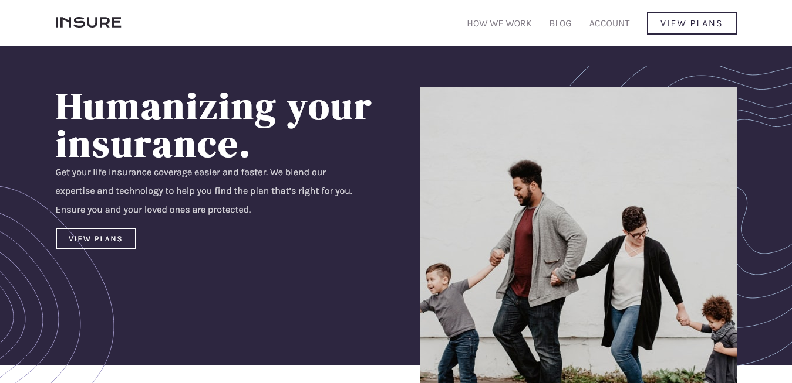
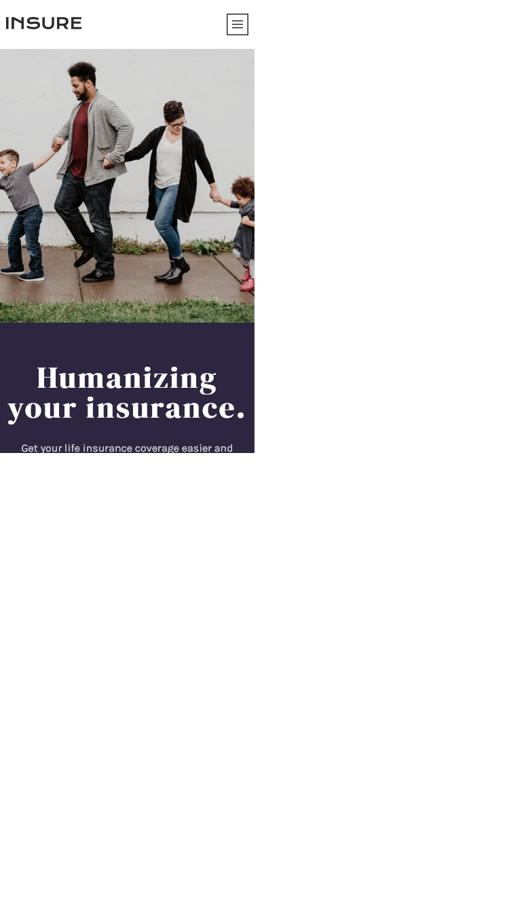

# Insure-Landing-Page
Insure Landing Page project from FrontEnd Mentor

[Frontend Mentor](https://www.frontendmentor.io) challenges allow you to improve your skills in a real-life workflow.

## Table of contents

- [Built with](#built-with)
- [My thoughts](#my-thoughts)
  - [The solution](#the-solution)
  - [Screenshot](#screenshot)
  - [What I learned](#what-I-learned)
- [My process](#my-process)
- [Continued development](#continued-development)
- [Useful resources](#useful-resources)
  
  - [structural drawing](#structural-drawing)
- [What I learned](#what-i-learned)
- [Features](#features)
- [Issue Report](#issue-report)
- [Author](#author)
- [Acknowledgments](#acknowledgments)
- [Resources](#resources)

### Built with

- Semantic HTML5 markup
- Flex-box
- Vanilla JavaScript (mobile navigation)
- [Google font](https://fonts.google.com/), using the CSS3 @font-face

### My Thoughts

I had finished most of this project on my own, but I was not satisfied with
the result:

1. My header was not working properly in either the widescreen or the mobile
   versions, and the hero image was not above the header content in the mobile
   version, as the design called for.

2. I knew my code was anything but DRY, and I had a lot of named sections
   that could be confusing to revisit in the future.

3. The social media icons were visible in the widescreen footer, but they
   shrank and all but disappeared in the mobile footer, and I didn't know why.
   The button in the top navigation didn't line up properly with the
   navigation links.

### The Solution

I recently discovered Florin Pop's YouTube channel (link below), and I noticed
that he had a 2 1/2-hour live coding video demonstrating his version of this project.
I worked through the entire video, and merged parts of my solution into his
code, creating what you see here. I have many examples of how his code is
more DRY than mine was. For example, my code contained many named containers,
where Florin's code has much more simplicity.

My Code:

```html
<hr class="different-hr" />
<section class="different">
  <h2>We’re different</h2>
  <div class="different-container">
    <div class="snappy-placeholder">
      <div class="icon-placeholder">
        
      </div>
      <h4>Snappy Process</h4>

      <p>
        Our application process can be completed in minutes, not hours. Don’t
        get stuck filling in tedious forms.
      </p>
    </div>
  </div>
</section>
```

Florin's Code:

```html
<section class="container">
  <h2>We’re different</h2>
  <div class="flex">
    <div>
      
      <h3 class="space">Snappy Process</h3>
      <p class="space">
        Our application process can be completed in minutes, not hours. Don’t
        get stuck filling in tedious forms.
      </p>
    </div>
    </section>
```
Each section was given a class of 'container' and a class of 'flex.' In the
stylesheet, all that had to be done was to assign 'display: flex' to the
'flex' class for the widescreen version, and 'flex-direction: column' for
the mobile version, and the basic design would pop into place.

### JavaScript for the Mobile Navigation

The Vanilla JS navigation was very simple:

```javascript
  const hamburger = document.getElementById("hamburger");
  const menu = document.getElementById("menu");

  hamburger.addEventListener("click", () => {
    hamburger.classList.toggle("show");
    menu.classList.toggle("show");
  });
```

### Screenshot





    
### What I learned
    
I am learning more about Flexbox, such as 'align-items: center;' which I used
to properly align the top navigation button with the links. I have since used
this to align icons and other elements on other FrontEnd Mentor projects that
 I had been having problems with.

### My Process
1. First I mark up the content using semantic HTML5
2. Next, I apply the base styles in CSS3 as well as the custom font stack
3. Then I add the images
4. Next, I build out the design, working from the top down, including the mobile version
5. Finally, I apply JavaScript for the mobile navigation, form validation, etc.

### Continued Development

Thanks again to Florin Pop, I have learned how to create a simple mobile
navigation using JavaScript, which I am applying to several
FrontEnd Mentor projects. I am going to practice this technique until it
becomes effortless, and I would like to memorize the code so I can just type
it out without having to use any references. I have created a carousel using
JS in the past, but I need to relearn this technique so I can use it on
projects such as the Arch Studio project I am currently building. I am
working through a couple of courses on Udemy to learn JavaScript, and I
want to continue using what I learn on all my projects. I am currently
learning about string-template-literals and functions.
    
### Useful Resources
1. Code along with Florin Pop: Insure Landing Page
(https://www.youtube.com/watch?v=9HVKR_hK0nY&t=7659s)
I highly recommend this video for anyone who struggles with any part of this project, or for
anyone who wants to improve their code. Florin's entire YouTube channel is
an excellent resource of inspiration and knowledge.
    
2. Darian Sampare
https://bit.ly/2Wy0QuR
Darian is a freelance web developer. I discovered this channel a couple of days ago, and I have found it to be an invaluable resource.
One interesting service he provides is to review Front-End and Full-Stack Developer resumes and portfolio websites on his channel. His insights are invaluable. Two examples are:

1. "Software Developer Portfolio Reviews | One of the most creative developer portfolios I’ve ever seen"
https://bit.ly/3kEEfoS

2. "How I learn any new programming language in a week | Learn Programming Fast"
https://bit.ly/3yy8WkD
    
 
[Robert B. Spatz Portfolio](https://rspatz.github.io/RBSpatz-Portfolio/)
Frontend Mentor -
[@rspatz](https://www.frontendmentor.io/profile/rspatz) -
Twitter - [@RBSpatzDesign](https://twitter.com/RBSpatzDesign)
